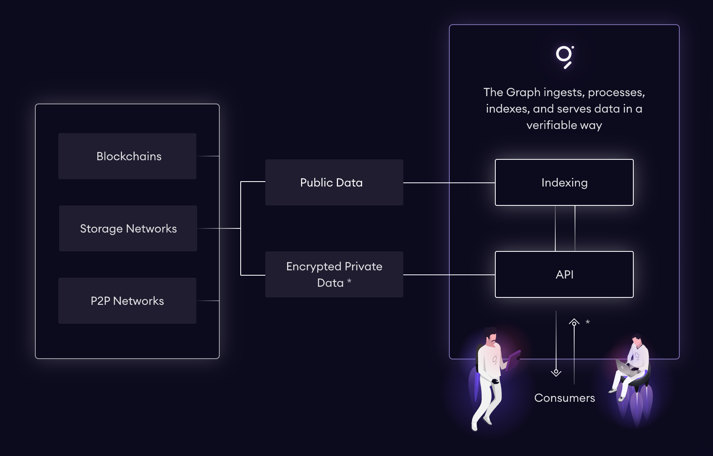
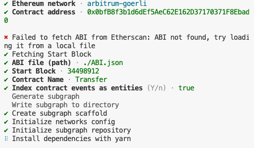

# Introduction of The Graph Protocol

The Graph is a decentralized indexing system that allows users to query data from blockchain networks, making DApp development easier. The Graph is an open-source protocol hosted on the Ethereum blockchain, designed for indexing and querying, much like Google.

# How does it work?

The Graph’s decentralized indexing protocol uses open-source application programming interfaces (APIs) known as subgraphs, indexes that organize data within a global blockchain graph according to a user’s query through graphql.

# What problem does it solve?

By providing a decentralized indexing protocol that automates the process, The Graph addresses the issue of centralized blockchain data indexing and querying. It makes indexing and querying blockchain data more efficient, much like google.

# Steps to get started with Subgraph

### Understanding Subgraph

In the context of the graph protocol in blockchain, a subgraph refers to a subset of data from the blockchain that is organized and indexed for efficient querying and analysis.

Indexing refers to the process of creating data structures that organize the data in a manner that enables faster searching and retrieval. In the context of the graph protocol, indexing involves creating indexes or data structures that optimize the querying of specific data within the subgraph.

Indexes can take various forms, such as hash tables, B-trees or other data structures optimized for quick data access. The specific indexing techniques employed depend on the requirements of the subgraph and the nature of the data being indexed.

### How does Graph work



### Task at hand

Use subgraph with graphql to access data from the subgraph and display in the react app

- Install Vite (React.js)
- Install graphql and urql(graphql query)
- Import subgraph query url from the thegraph.com/explorer/subgraphs of any subgraphs. We are using this [subgraph](https://thegraph.com/explorer/subgraphs/8sE6rTNkPhzZXZC6c8UQy2ghFTu5PPdGauwUBm4t7HZ1?view=Playground&chain=mainnet)

> **NOTE:** Only 1000 API calls are free. Use API Key from Subgraph Studio

- Generate the API key from the Graph studio.
- Create and copy the Graphql Query from the Playground. We are copying the following query

```gql
{
  tokens(first: 5) {
    id
    name
    symbol
    decimals
  }
}
```

- Create graphql Provider and Client similar to redux store or context hook
- Add the Provider with client in the App.tsx
- Fetch the data from the query using the urql
- List the data

# How to create your own subgraph

1. Create the folder called generate-subgraph (You can name it anything you like)
2. Visit the subgraph studio [Link](thegraph.com/studio)
3. Click create subgraph
4. Follow the instructions as listed there.
5. Check if the graph is installed by using `graph --version` in the terminal
6. Use you any Smart Contract address to index the txn data. I have created my own called Transfer.sol
7. Continue by `graph init --studio <contract-name>`
8. Answer the questions
   
9. Artifacts are generated
10. Look into the schema.graphql inside the newly created folders. You can modify as you like
11. If there is no events in smart contract, there will not be any Subgraph query
12. Go back to Studio and copy the command for `auth and deploy`
13. Once deployed, use remix to perform event based txn
14. Visit your subgraph playground to interact with it.
